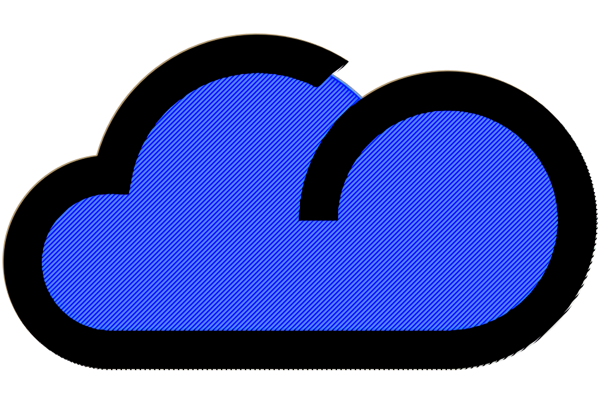

#  Météo 77

Web weather data viewer and its API.

### myappfront

Contains frontend (Vue.js).

**STACK :** Vue.js (+ axios, vue-router), Leaflet, Moment.js, Chart.js, Plotly

In the source code, to define the different APIs that the frontend should display, there is a configuration file [**stations.json**](./myappfront/public/stations.json) available at ```myappfront/public/```.

### myapp

Contains backend and API (Node.js).

**STACK :** Express.js, MongoDB

#### Adding to the database

*stock.js* file allows data to be added to the mongo database. As soon as one of the monitored files is updated, the file in question will be fetched and added to the mongo database in the table corresponding to the file.

#### Communication with the frontend

The second part of the API is used to retrieve a request from the front end and return the data requested by the user. The file allowing this is contained in the *routes* directory and is called *data.js*.
